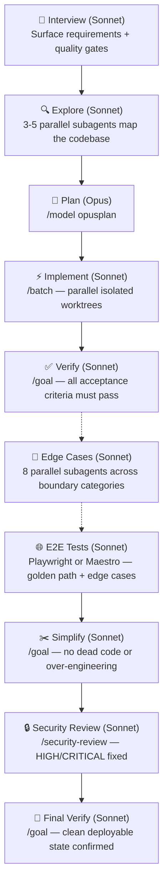

# ship.md

The end-to-end skill for shipping features without gaps. Up to 10 phases from interview to final verify. Wraps Claude Code's built-in `/batch`, `/goal`, and `/model` commands into a single quality-gated pipeline.



## Skills

### Core

| Skill | What it does |
|-------|-------------|
| [`/ship`](skills/ship/SKILL.md) | Full 10-phase pipeline: interview, explore, plan, implement, verify, edge cases, e2e tests, simplify, security review, final verify |
| [`/ship-fast`](skills/ship-fast/SKILL.md) | Quick implementation for simple features that don't need the full pipeline. No security review, edge cases, or simplify pass |

### Optional Dependencies

| Skill | What it does |
|-------|-------------|
| [`/edge-cases`](skills/edge-cases/SKILL.md) | Systematic edge case discovery and hardening. Spawns 8 parallel subagents across boundary, null, concurrency, auth, and other categories. Opted in during `/ship` Phase 1 |
| [`/e2e`](skills/e2e/SKILL.md) | End-to-end test authoring with Playwright (web) or Maestro (mobile/React Native/Flutter). Golden path + critical edge cases. Opted in during `/ship` Phase 1 |

## Quickstart

```bash
npx skills add amajorai/ship.md
```

Installs both skills and auto-configures them for whichever coding agents you have installed (Claude Code, Codex, Cursor, and 50+ others).

Install a single skill:

```bash
npx skills add amajorai/ship.md/skills/ship
```

### Claude Code plugin

```
/plugin marketplace add amajorai/ship.md
/plugin install shipmd@amajorai
```

Invoke as `/shipmd:ship <task>` or `/shipmd:ship-fast <task>`.

## Built-in commands used

`/ship` orchestrates these Claude Code built-ins and bundled skills:

- `/model opusplan` — Opus for planning, auto-switches to Sonnet for execution
- `/batch` — parallel implementation across isolated git worktrees
- `/goal` — autonomous quality loops for verify, simplify, and security phases
- `/security-review` — built-in security audit
- `/edge-cases` — bundled in this repo (Phase 6)
- `/e2e` — bundled in this repo (Phase 7)

---

Part of [amajorai/skills](https://github.com/amajorai/skills). For more skills check out the full collection.
