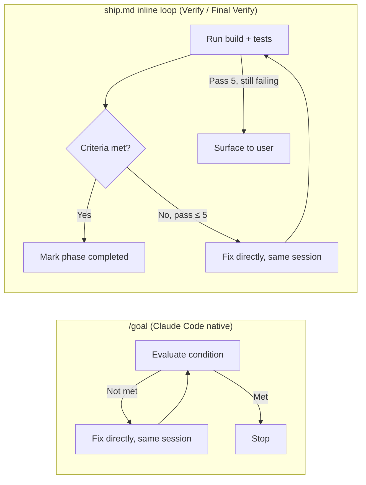

# 📦 ship.md

A thin, structured workflow for shipping features with Claude Code. Not a full-blown framework like [GSD](https://github.com/gsd-build/get-shit-done) or [bmad-method](https://github.com/bmad-method/bmad-method). Just a wrapper around Claude Code's own built-in commands (`/batch`, `/goal`, `/model`, `/security-review`) that adds structure, quality gates, and optional GitHub issue tracking so nothing falls through the cracks.

Simple, minimal, lean. Explore first, ask only what the codebase can't answer, then plan and ship.

[](https://github.com/amajorai/ship.md)
[](https://github.com/amajorai/ship.md)
[](https://github.com/amajorai/ship.md)
[](https://github.com/amajorai/ship.md)
[](https://github.com/amajorai/ship.md/issues)

> [!NOTE]
> These skills have been built and tested with **Claude Code**. Codex support is untested. If you try them on Codex, we'd love your help. [Open an issue](https://github.com/amajorai/ship.md/issues) to share what works and what doesn't.

## Quickstart

```bash
npx skills add -g amajorai/ship.md
```

Then in Claude Code:

```
/ship add dark mode to the settings page
```

or for something quick:

```
/ship-fast fix the typo in the onboarding copy
```

### Update

```bash
# Update this skill
npx skills update ship

# Update multiple skills
npx skills update ship ship-fast

# Update all installed skills (interactive scope prompt)
npx skills update

# Update all global skills non-interactively
npx skills update -g -y
```

### Claude Code plugin

```
/plugin marketplace add amajorai/ship.md
/plugin install shipmd@amajorai
```

Invoke as `/shipmd:ship <task>` or `/shipmd:ship-fast <task>`.

## Claude Code commands used

| Command | Phase | What it does |
|---------|-------|-------------|
| `/model opusplan` | Plan | Switches to Opus for planning, auto-returns to Sonnet for execution |
| `/batch` (inline) | Implement | Can't be invoked programmatically — ship replicates it using [references/batch.md](skills/ship/references/batch.md) |
| `/goal` (inline) | Verify + Final Verify | In-session loop: run tests, evaluate criteria, fix directly, repeat (max 5 passes) — see below |
| `/edge-cases` | Edge Cases (opt-in) | From [amajorai/skills](https://github.com/amajorai/skills) — 8 parallel subagents across boundary categories |
| `/e2e` | E2E Tests (opt-in) | From [amajorai/skills](https://github.com/amajorai/skills) — agent-browser, Playwright, or Maestro, with Computer Use fallback |
| `/code-review` | Code Review | Built-in audit — fix CONFIRMED + PLAUSIBLE findings before proceeding |
| `/security-review` | Security Review | Built-in audit — all HIGH/CRITICAL findings fixed before proceeding |
| `TaskCreate` / `TaskUpdate` | All phases | Claude Code's built-in todos — one task per phase, blocked in sequence, visible live in the task UI |

## Works great with

- 👻 **[spec.md](https://github.com/amajorai/spec.md)** before you start -- breaks any task into atomic, agent-ready GitHub issues so `/ship` always has a clear, scoped unit to work from.
- 🔎 **[fix.md](https://github.com/amajorai/fix.md)** when something breaks after shipping. `/fix` instruments the code with targeted logs, reads them to confirm root cause, and makes a surgical fix.
- 🪅 **[vibe.md](https://github.com/amajorai/vibe.md)** to spin up your production server, deploy pipeline, and scaffold your project before you start shipping.
- 🎉 **[party.md](https://github.com/amajorai/party.md)** to run ship.md autonomously 24/7. Drop issues into a GitHub Projects board; party.md picks them up and delegates building to `/ship` automatically.
- 🎬 **[replay.md](https://github.com/amajorai/replay.md)** to record video proof of your feature working — browser automation, VNC, or Computer Use — and share the link straight from chat.
- ⚡ **[amajorai/skills](https://github.com/amajorai/skills)** for edge cases, E2E, payments, auth, SEO, icons, CI, observability, and 20+ more.

## Skills

| Skill | What it does |
|-------|-------------|
| [`/ship`](skills/ship/SKILL.md) | Full 10-phase pipeline: explore+interview loop (explore first, ask one question at a time only for what the codebase can't answer), plan, implement, verify, edge cases, e2e tests, code review, security review, final verify. Optionally creates atomic GitHub issues per unit |
| [`/ship-fast`](skills/ship-fast/SKILL.md) | Lightweight 4-phase flow for simple features. Explore-first interview, plan, implement, verify. Skips security review, edge cases, and E2E |

## How it works

```mermaid
flowchart TD
    subgraph sf["⚡ /ship-fast  (stops here)"]
        A["🔍 Explore (Sonnet)\n3-5 parallel subagents map the codebase"] --> B{"Still open\nareas?"}
        B -->|"Yes"| C["🎤 Interview (Sonnet)\nAsk 1 question at a time — answer may resolve others"]
        C --> A
        B -->|"No"| D["🧠 Plan (Opus)\n/model opusplan"]
        D --> E["⚡ Implement (Sonnet)\n/batch: parallel isolated worktrees"]
        E --> F["✅ Verify (Sonnet)\n/goal: all acceptance criteria must pass"]
    end
    F -.-> G["🧪 Edge Cases (Sonnet)\n8 parallel subagents across boundary categories"]
    G -.-> H["🌐 E2E Tests (Sonnet)\nPlaywright or Maestro: golden path + edge cases"]
    H -.-> I["🔍 Code Review (Sonnet)\n/code-review: fix CONFIRMED + PLAUSIBLE findings"]
    F -.-> I
    I --> J["🔒 Security Review (Sonnet)\n/security-review: HIGH/CRITICAL fixed"]
    J --> K["🏁 Final Verify (Sonnet)\n/goal: clean deployable state confirmed"]

    style sf fill:#1a1a2e,stroke:#4a4a8a
```



## /batch

Phase 4 (Implement) dispatches units in parallel using one of two modes. The mode is chosen during the Phase 1+2 interview. The full instructions live in [`skills/ship/references/batch.md`](skills/ship/references/batch.md).

| Mode | When | PR strategy |
|------|------|-------------|
| **A - Isolated Worktrees** | Units have no shared files | One PR per unit (mirrors `/batch` exactly) |
| **B - Shared Workspace** | Units share files or types | One PR for the whole branch |

**Mode A** mirrors `/batch` exactly: decompose into 5–30 self-contained units, discover an E2E recipe, then spawn one background agent per unit in a single message block (`isolation: "worktree"`, `run_in_background: true`). Each agent implements, runs code-review + unit tests + E2E, commits, pushes, and opens a PR. A status table tracks progress and PR links as agents complete.

**Mode B** uses a dependency-wave model: wave 1 has no blockers (foundational types, schema, utilities); each subsequent wave depends on the previous. All units in the current wave run in parallel; the coordinator waits for all before dispatching the next. Agents commit only — no PRs. The coordinator opens a single PR covering the full branch after all waves finish.

## /goal loop

`/goal` is a Claude Code CLI stop hook, not a programmatic command — it can't be invoked from inside a skill via `Skill({ skill: "goal" })`. Ship replicates its behavior directly in-session for the Verify and Final Verify phases.



Both stay in the **same session** (no subagents, full context retained) and fix directly without hand-off. The difference: `/goal` has no pass cap and is user-initiated. Ship's loop caps at 5 passes and escalates to the user on failure rather than looping forever.

## GitHub integration

### Deployment checks

Both `/ship` and `/ship-fast` can poll your CI/CD deployment after the verify phase(s). Opt in during the interview.

When enabled, after local tests pass the skill polls:

```bash
gh api "repos/{owner}/{repo}/deployments?environment=production&per_page=1" --jq '.[0].id'
gh api "repos/{owner}/{repo}/deployments/{id}/statuses?per_page=1" --jq '.[0].state'
```

- `success` → continues to the next phase.
- `pending` / `in_progress` / `queued` → waits 30 s and polls again (up to 20 polls).
- `failure` / `error` → inspects logs, diagnoses the root cause, fixes the code, pushes, and restarts the poll. After 3 failed fix attempts it surfaces to you before continuing.

`/ship` runs this check at the end of both Phase 5 (Verify) and Phase 10 (Final Verify).

### Issue tracking

`/ship` can create and manage GitHub issues throughout the pipeline. Opt in during the interview. When enabled:

**Labels** are auto-created on your repo for each phase so you can filter issues in GitHub's UI:

| Label | Phase |
|-------|-------|
| `📦 ship` | Parent epic |
| `📋 plan` | Planning in progress |
| `🔨 implement` | Implementation in progress |
| `✅ verify` | Verification in progress |
| `🔍 edge cases` | Edge case hardening |
| `🧪 e2e` | E2E test writing |
| `✂️ simplify` | Simplification pass |
| `🔒 security` | Security review |

**Issues** are structured with goal, task, context, acceptance criteria, and explicit "out of scope" sections. The phase label on the epic updates live as the pipeline progresses so you can watch the work move through stages in GitHub.

**Epic + sub-issues** are linked via GitHub's sub-issue API so the hierarchy shows up in project views. Each sub-issue is self-contained enough that a single agent can pick it up and close it independently.

**PRs** are created and linked to their issues (`Closes #N`) at the end of Phase 4. On the shared-workspace path (recommended), one PR covers the full branch. On isolated worktrees, each unit gets its own PR.

**Closing** is automatic: each implementing agent closes its own sub-issue on completion; the orchestrator closes the epic at the end of the pipeline.

## Star History

<a href="https://www.star-history.com/#amajorai/ship.md&Date">
 <picture>
   <source media="(prefers-color-scheme: dark)" srcset="https://api.star-history.com/svg?repos=amajorai/ship.md&type=Date&theme=dark" />
   <source media="(prefers-color-scheme: light)" srcset="https://api.star-history.com/svg?repos=amajorai/ship.md&type=Date" />
   
 </picture>
</a>

