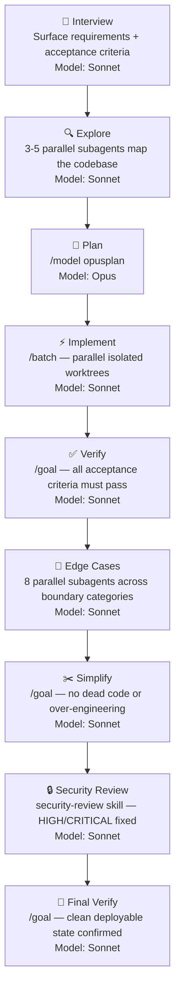

# ship.md

The end-to-end skill for shipping features without gaps. 9 phases from interview to final verify. Wraps Claude Code's built-in `/batch`, `/goal`, and `/model` commands into a single quality-gated pipeline.



## Skills

| Skill | What it does |
|-------|-------------|
| [`/ship`](skills/ship/SKILL.md) | Full 9-phase pipeline: interview, explore, plan, implement, verify, edge cases, simplify, security review, final verify |
| [`/ship-simple`](skills/ship-simple/SKILL.md) | Quick implementation for simple features that don't need the full pipeline. No security review, edge cases, or simplify pass |

## Installation

### skills.sh (recommended)

```bash
npx skills add amajorai/ship.md
```

Installs both skills and auto-configures them for whichever coding agents you have installed (Claude Code, Codex, Cursor, and 50+ others).

Install a single skill:

```bash
npx skills add amajorai/ship.md/skills/ship
```

### Claude Code plugin

```
/plugin marketplace add amajorai/ship.md
/plugin install shipmd@amajorai
```

Invoke as `/shipmd:ship <task>` or `/shipmd:ship-simple <task>`.

### install.sh (one-liner)

```bash
curl -fsSL https://raw.githubusercontent.com/amajorai/ship.md/main/install.sh | bash
```

```bash
# Codex
curl -fsSL https://raw.githubusercontent.com/amajorai/ship.md/main/install.sh | bash -s -- --codex
```

Or clone and run manually:

```bash
git clone https://github.com/amajorai/ship.md.git
cd ship.md

./install.sh           # Claude Code, copies to ~/.claude/skills/, invoke as /ship
./install.sh --codex   # Codex, copies to ~/.codex/skills/, invoke as $ship
```

## Built-in commands used

`/ship` orchestrates these Claude Code built-ins. No external dependencies needed:

- `/model opusplan` — Opus for planning, auto-switches to Sonnet for execution
- `/batch` — parallel implementation across isolated git worktrees
- `/goal` — autonomous quality loops for verify, simplify, and security phases
- `security-review` skill — built-in security audit

---

Part of [amajorai/skills](https://github.com/amajorai/skills). For more skills check out the full collection.
