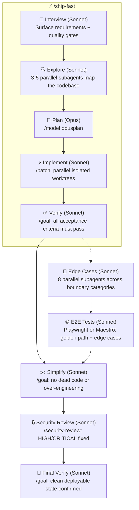

# 📦 ship.md

The end-to-end skill for shipping features without gaps. Up to 10 phases from interview to final verify. Works with Claude Code and Codex — wraps built-in `/batch`, `/goal`, and `/model` commands into a single quality-gated pipeline, with Codex fallbacks for each phase.



## Skills

| Skill | What it does |
|-------|-------------|
| [`/ship`](skills/ship/SKILL.md) | Full 10-phase pipeline: interview, explore, plan, implement, verify, edge cases, e2e tests, simplify, security review, final verify. Optionally creates atomic GitHub issues per unit (asked during interview) |
| [`/ship-fast`](skills/ship-fast/SKILL.md) | Quick implementation for simple features that don't need the full pipeline. No security review, edge cases, or simplify pass |

## Built-in commands used

`/ship` orchestrates these Claude Code built-ins:

- `/model opusplan` - Opus for planning, auto-switches to Sonnet for execution
- `/batch` - parallel implementation across isolated git worktrees
- `/goal` - autonomous quality loops for verify, simplify, and security phases
- `/security-review` - built-in security audit
- `/edge-cases` - from amajorai/skills (Phase 6, optional)
- `/e2e` - from amajorai/skills (Phase 7, optional)

## Quickstart

```bash
npx skills add amajorai/ship.md
```

Installs both skills and auto-configures them for whichever coding agents you have installed (Claude Code, Codex, Cursor, and 50+ others).

### Auto-Update

`/ship` and `/ship-fast` run `npx skills update <name> -y` at the start of each invocation and update themselves if a new version is available, then ask you to re-run.

`/ship` also checks whether its optional dependencies (`/edge-cases` and `/e2e`) are installed, and offers to fetch them from [amajorai/skills](https://github.com/amajorai/skills) if missing.

To opt out of auto-update, add `--no-update` to your command or set `SKILLS_AUTO_UPDATE: false` in your project CLAUDE.md.

### Claude Code plugin

```
/plugin marketplace add amajorai/ship.md
/plugin install shipmd@amajorai
```

Invoke as `/shipmd:ship <task>` or `/shipmd:ship-fast <task>`.

---

Part of [amajorai/skills](https://github.com/amajorai/skills). For more skills check out the full collection.
