# 📦 ship.md

A thin, structured workflow for shipping features with Claude Code. Not a full-blown framework like [GSD](https://github.com/gsd-build/get-shit-done) or [bmad-method](https://github.com/bmad-method/bmad-method). Just a wrapper around Claude Code's own built-in commands (`/batch`, `/goal`, `/model`, `/security-review`) that adds structure, quality gates, and optional GitHub issue tracking so nothing falls through the cracks.

Simple, minimal, lean. One interview, one plan, ship the thing.

[](https://github.com/amajorai/ship.md)
[](https://github.com/amajorai/ship.md)
[](https://github.com/amajorai/ship.md)
[](https://github.com/amajorai/ship.md)
[](https://github.com/amajorai/ship.md/issues)

## Works great with

- 🪅 **[vibe.md](https://github.com/amajorai/vibe.md)** to spin up your production server, deploy pipeline, and scaffold your project before you start shipping.
- 🎉 **[party.md](https://github.com/amajorai/party.md)** to run ship.md autonomously 24/7. Drop issues into a GitHub Projects board; party.md picks them up and delegates building to `/ship` automatically.
- 🎬 **[replay.md](https://github.com/amajorai/replay.md)** to record video proof of your feature working — browser automation, VNC, or Computer Use — and share the link straight from chat.
- ⚡ **[amajorai/skills](https://github.com/amajorai/skills)** for edge cases, E2E, payments, auth, SEO, icons, CI, observability, and 20+ more.

## Skills

| Skill | What it does |
|-------|-------------|
| [`/ship`](skills/ship/SKILL.md) | Full 10-phase pipeline: interview, explore, plan, implement, verify, edge cases, e2e tests, simplify, security review, final verify. Optionally creates atomic GitHub issues per unit (asked during interview) |
| [`/ship-fast`](skills/ship-fast/SKILL.md) | Lightweight 5-phase flow for simple features. Skips security review, edge cases, and simplification |

## How it works

```mermaid
flowchart TD
    subgraph sf["⚡ /ship-fast  (stops here)"]
        A["🎤 Interview (Sonnet)\nSurface requirements + quality gates"] --> B["🔍 Explore (Sonnet)\n3-5 parallel subagents map the codebase"]
        B --> C["🧠 Plan (Opus)\n/model opusplan"]
        C --> D["⚡ Implement (Sonnet)\n/batch: parallel isolated worktrees"]
        D --> E["✅ Verify (Sonnet)\n/goal: all acceptance criteria must pass"]
    end
    E -.-> F["🧪 Edge Cases (Sonnet)\n8 parallel subagents across boundary categories"]
    F -.-> G["🌐 E2E Tests (Sonnet)\nPlaywright or Maestro: golden path + edge cases"]
    G -.-> H["✂️ Simplify (Sonnet)\n/goal: no dead code or over-engineering"]
    E -.-> H
    H --> I["🔒 Security Review (Sonnet)\n/security-review: HIGH/CRITICAL fixed"]
    I --> J["🏁 Final Verify (Sonnet)\n/goal: clean deployable state confirmed"]

    style sf fill:#1a1a2e,stroke:#4a4a8a
```



## GitHub deployment checks

Both `/ship` and `/ship-fast` can poll your CI/CD deployment after the verify phase(s). Opt in during the interview.

When enabled, after local tests pass the skill polls:

```bash
gh api "repos/{owner}/{repo}/deployments?environment=production&per_page=1" --jq '.[0].id'
gh api "repos/{owner}/{repo}/deployments/{id}/statuses?per_page=1" --jq '.[0].state'
```

- `success` → continues to the next phase.
- `pending` / `in_progress` / `queued` → waits 30 s and polls again (up to 20 polls).
- `failure` / `error` → inspects logs, diagnoses the root cause, fixes the code, pushes, and restarts the poll. After 3 failed fix attempts it surfaces to you before continuing.

`/ship` runs this check at the end of both Phase 5 (Verify) and Phase 10 (Final Verify).

## GitHub issue tracking

`/ship` can create and manage GitHub issues throughout the pipeline. Opt in during the interview. When enabled:

**Labels** are auto-created on your repo for each phase so you can filter issues in GitHub's UI:

| Label | Phase |
|-------|-------|
| `📦 ship` | Parent epic |
| `📋 plan` | Planning in progress |
| `🔨 implement` | Implementation in progress |
| `✅ verify` | Verification in progress |
| `🔍 edge cases` | Edge case hardening |
| `🧪 e2e` | E2E test writing |
| `✂️ simplify` | Simplification pass |
| `🔒 security` | Security review |

**Issues** are structured with goal, task, context, acceptance criteria, and explicit "out of scope" sections. The phase label on the epic updates live as the pipeline progresses so you can watch the work move through stages in GitHub.

**Epic + sub-issues** are linked via GitHub's sub-issue API so the hierarchy shows up in project views. Each sub-issue is self-contained enough that a single agent can pick it up and close it independently.

**PRs** are created and linked to their issues (`Closes #N`) at the end of Phase 4. On the shared-workspace path (recommended), one PR covers the full branch. On isolated worktrees, each unit gets its own PR.

**Closing** is automatic: each implementing agent closes its own sub-issue on completion; the orchestrator closes the epic at the end of the pipeline.

## Built-in commands used

`/ship` orchestrates these Claude Code built-ins:

- `/model opusplan`: Opus for planning, auto-switches to Sonnet for execution
- `/batch`: parallel implementation across isolated git worktrees
- `/goal` behavior: verify, simplify, and final verify phases replicate `/goal` by looping **in the same session** — run tests, evaluate against acceptance criteria, fix directly, repeat (max 5 passes). No subagents. This is what `/goal` does: keeps Claude in the same context, iterating until the condition is met. `/goal` itself can't be invoked programmatically from within a skill (it's a UI/CLI stop hook, not a `Skill` tool call), so the skill implements the equivalent pattern directly.
- `/security-review`: built-in security audit
- `/edge-cases`: from [amajorai/skills](https://github.com/amajorai/skills) (Phase 6, optional)
- `/e2e`: from [amajorai/skills](https://github.com/amajorai/skills) (Phase 7, optional)
- **Task tools** (`TaskCreate`, `TaskUpdate`): creates a task per phase after the interview so you can watch live progress in Claude Code's task UI

## Quickstart

```bash
npx skills add amajorai/ship.md
```

Then in Claude Code:

```
/ship add dark mode to the settings page
```

or for something quick:

```
/ship-fast fix the typo in the onboarding copy
```

### Auto-Update

Auto-update is **disabled by default**. Skills do not self-update unless you explicitly opt in (supply chain hygiene). To enable, pass `--update` to your command or set `SKILLS_AUTO_UPDATE: true` in your project CLAUDE.md.

`/ship` also checks whether its optional dependencies (`/edge-cases` and `/e2e`) are installed and offers to fetch them from [amajorai/skills](https://github.com/amajorai/skills) if missing.

### Claude Code plugin

```
/plugin marketplace add amajorai/ship.md
/plugin install shipmd@amajorai
```

Invoke as `/shipmd:ship <task>` or `/shipmd:ship-fast <task>`.

## Star History

<a href="https://www.star-history.com/#amajorai/ship.md&Date">
 <picture>
   <source media="(prefers-color-scheme: dark)" srcset="https://api.star-history.com/svg?repos=amajorai/ship.md&type=Date&theme=dark" />
   <source media="(prefers-color-scheme: light)" srcset="https://api.star-history.com/svg?repos=amajorai/ship.md&type=Date" />
   
 </picture>
</a>

