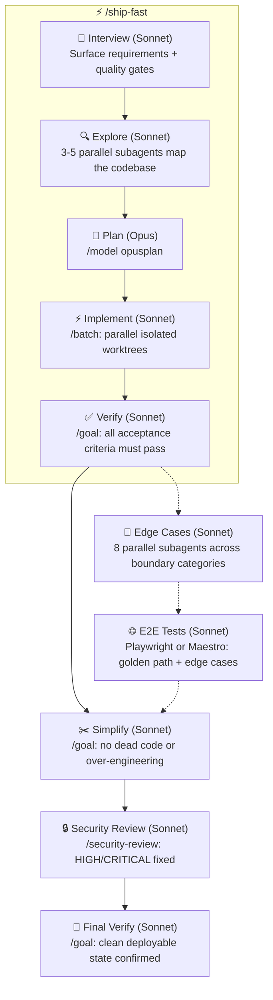

# 📦 ship.md

A thin, structured workflow for shipping features with Claude Code. Not a full-blown framework — no DSL, no agents-within-agents orchestration, no opinionated stack. Just a wrapper around Claude Code's own built-in commands (`/batch`, `/goal`, `/model`, `/security-review`) that adds structure, quality gates, and optional GitHub issue tracking so nothing falls through the cracks.

If you've looked at [bmad-method](https://github.com/bmad-method/bmad-method) or other agent frameworks and thought "this is too much" — this is for you. ship.md is lean by design: one interview, one plan, ship the thing, done.



## Skills

| Skill | What it does |
|-------|-------------|
| [`/ship`](skills/ship/SKILL.md) | Full 10-phase pipeline: interview, explore, plan, implement, verify, edge cases, e2e tests, simplify, security review, final verify. Optionally creates atomic GitHub issues per unit (asked during interview) |
| [`/ship-fast`](skills/ship-fast/SKILL.md) | Lightweight 5-phase flow for simple features. Skips security review, edge cases, and simplification |

## GitHub issue tracking

`/ship` can create and manage GitHub issues throughout the pipeline — opt in during the interview. When enabled:

**Labels** are auto-created on your repo for each phase so you can filter issues in GitHub's UI:

| Label | Phase |
|-------|-------|
| `📦 ship` | Parent epic |
| `📋 plan` | Planning in progress |
| `🔨 implement` | Implementation in progress |
| `✅ verify` | Verification in progress |
| `🔍 edge cases` | Edge case hardening |
| `🧪 e2e` | E2E test writing |
| `✂️ simplify` | Simplification pass |
| `🔒 security` | Security review |

**Issues** are structured with goal, task, context, acceptance criteria, and explicit "out of scope" sections. The phase label on the epic updates live as the pipeline progresses — you can watch the work move through stages in GitHub.

**Epic + sub-issues** are linked via GitHub's sub-issue API so the hierarchy shows up in project views. Each sub-issue is self-contained enough that a single agent can pick it up and close it independently.

**PRs** are created and linked to their issues (`Closes #N`) at the end of Phase 4. On the shared-workspace path (recommended), one PR covers the full branch; on isolated worktrees, each unit gets its own PR.

**Closing** is automatic: each implementing agent closes its own sub-issue on completion; the orchestrator closes the epic at the end of the pipeline.

## Built-in commands used

`/ship` orchestrates these Claude Code built-ins:

- `/model opusplan` — Opus for planning, auto-switches to Sonnet for execution
- `/batch` — parallel implementation across isolated git worktrees
- `/goal` — autonomous quality loops for verify, simplify, and security phases
- `/security-review` — built-in security audit
- `/edge-cases` — from [amajorai/skills](https://github.com/amajorai/skills) (Phase 6, optional)
- `/e2e` — from [amajorai/skills](https://github.com/amajorai/skills) (Phase 7, optional)
- **Task tools** (`TaskCreate`, `TaskUpdate`) — creates a task per phase after the interview so you can watch live progress in Claude Code's task UI

## Quickstart

```bash
npx skills add amajorai/ship.md
```

Then in Claude Code:

```
/ship add dark mode to the settings page
```

or for something quick:

```
/ship-fast fix the typo in the onboarding copy
```

### Auto-Update

Auto-update is **disabled by default**. Skills do not self-update unless you explicitly opt in — this prevents untrusted code from running automatically during a session (supply chain hygiene).

`/ship` also checks whether its optional dependencies (`/edge-cases` and `/e2e`) are installed, and offers to fetch them from [amajorai/skills](https://github.com/amajorai/skills) if missing.

To enable auto-update, pass `--update` to your command or set `SKILLS_AUTO_UPDATE: true` in your project CLAUDE.md.

### Claude Code plugin

```
/plugin marketplace add amajorai/ship.md
/plugin install shipmd@amajorai
```

Invoke as `/shipmd:ship <task>` or `/shipmd:ship-fast <task>`.

---

## Need a dev environment first?

If you're starting from zero — no VPS, no deploy pipeline, no project scaffolded — check out **[vibe.md](https://github.com/amajorai/vibe.md)**. One interview spins up a Hetzner/OVH/AWS server, installs Bun + GitHub CLI, deploys Dokploy or Coolify, scaffolds a Better T Stack project, and wires up auto-deploy. Once you're set up, come back here and `/ship` your first feature.

---

Part of [amajorai/skills](https://github.com/amajorai/skills). For more skills check out the full collection.
