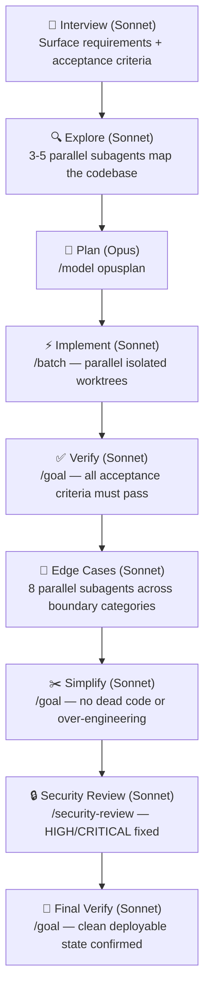

# ship.md

The end-to-end skill for shipping features without gaps. 9 phases from interview to final verify. Wraps Claude Code's built-in `/batch`, `/goal`, and `/model` commands into a single quality-gated pipeline.



## Skills

| Skill | What it does |
|-------|-------------|
| [`/ship`](skills/ship/SKILL.md) | Full 9-phase pipeline: interview, explore, plan, implement, verify, edge cases, simplify, security review, final verify |
| [`/ship-fast`](skills/ship-fast/SKILL.md) | Quick implementation for simple features that don't need the full pipeline. No security review, edge cases, or simplify pass |
| [`/edge-cases`](skills/edge-cases/SKILL.md) | Systematic edge case discovery and hardening. Spawns 8 parallel subagents across boundary, null, concurrency, auth, and other categories. Required by `/ship` Phase 6 |

## Installation

### skills.sh (recommended)

```bash
npx skills add amajorai/ship.md
```

Installs both skills and auto-configures them for whichever coding agents you have installed (Claude Code, Codex, Cursor, and 50+ others).

Install a single skill:

```bash
npx skills add amajorai/ship.md/skills/ship
```

### Claude Code plugin

```
/plugin marketplace add amajorai/ship.md
/plugin install shipmd@amajorai
```

Invoke as `/shipmd:ship <task>` or `/shipmd:ship-fast <task>`.

### install.sh (one-liner)

```bash
curl -fsSL https://raw.githubusercontent.com/amajorai/ship.md/main/install.sh | bash
```

```bash
# Codex
curl -fsSL https://raw.githubusercontent.com/amajorai/ship.md/main/install.sh | bash -s -- --codex
```

Or clone and run manually:

```bash
git clone https://github.com/amajorai/ship.md.git
cd ship.md

./install.sh           # Claude Code, copies to ~/.claude/skills/, invoke as /ship
./install.sh --codex   # Codex, copies to ~/.codex/skills/, invoke as $ship
```

## Built-in commands used

`/ship` orchestrates these Claude Code built-ins and bundled skills:

- `/model opusplan` — Opus for planning, auto-switches to Sonnet for execution
- `/batch` — parallel implementation across isolated git worktrees
- `/goal` — autonomous quality loops for verify, simplify, and security phases
- `/security-review` — built-in security audit
- `/edge-cases` — bundled in this repo (Phase 6)

---

## Phase 1: Interview

Before touching any code, conduct a structured interview to surface hidden requirements and establish clear acceptance criteria.

Ask the user about (combine related questions — don't fire them one by one):

- **Scope**: Which files, modules, or systems are in scope? What is explicitly out of scope?
- **Acceptance criteria**: What does done look like? How will we verify correctness?
- **Constraints**: Performance requirements, backwards compatibility, existing patterns to follow, team conventions?
- **Ambiguities**: Unclear terms, conflicting requirements, or edge cases in the task description?

Do not proceed until you have enough information to write unambiguous acceptance criteria. Write them as a numbered list and confirm with the user before continuing.


## Phase 2: Explore

Spawn **3–5 parallel subagents** to map the codebase. Each covers a distinct area:

- **Data / schema layer** — models, types, database schema, migrations
- **Feature area** — the code most directly relevant to the task
- **Tests and patterns** — how similar things are tested and implemented elsewhere
- **Dependencies and integrations** — what the affected code connects to upstream and downstream
- **Config / infrastructure** — only if the task touches deployment, environment, or build

Each subagent returns: what it found, what's relevant, and any risks or surprises.

Synthesize findings into a single **Context Summary**: current state, key constraints, implementation risks, suggested entry points.


## Phase 3: Plan

Switch to the strongest available reasoning model:
- **Claude Code:** `/model opusplan` — runs Opus for planning, auto-switches to Sonnet for execution
- **Codex:** `/model o3`, then `/plan`

The plan must specify:
1. Exact files to create or modify (with line-level specificity where possible)
2. Implementation order respecting the dependency graph
3. How each acceptance criterion from Phase 1 will be satisfied
4. Test strategy — new tests to write, existing tests to update

Do not begin implementation until the user explicitly approves the plan.


## Phase 4: Implement

Decompose the approved plan into **independent units** and execute in parallel:

- **Claude Code:** Run `/batch` — it creates isolated git worktrees and opens one PR per unit. If `/batch` is unavailable, spawn parallel agents with `isolation: "worktree"`.
- **Codex:** Spawn parallel subagents, one per unit. Assign non-overlapping files where possible. Resolve conflicts before proceeding.

Wait for all units to complete before moving to quality gates.


## Phase 5: Verify

Run `/goal` with this condition (adapt to the specific task):

```
All acceptance criteria from Phase 1 are met. All existing tests pass. No linting errors or type errors. The feature works end-to-end including edge cases defined during Phase 1.
```

**Claude Code fallback:** If `/goal` is unavailable, invoke the built-in `verify` skill and spawn Opus agents to validate each criterion manually.

Do not proceed until every criterion passes.


## Phase 6: Edge Cases

Invoke the `edge-cases` skill, targeting the files and feature area changed in Phase 4:

```
/edge-cases <feature area or changed files>
```

This runs 8 parallel subagents to enumerate edge cases across boundary values, null inputs, invalid types, error states, concurrency, adversarial data, state machine violations, and auth boundaries. It then writes tests for every unhandled P0/P1 case, confirms each test fails before the fix and passes after, and verifies no regressions.

Do not proceed until all P0 and P1 edge cases are covered and the full test suite passes.


## Phase 7: Simplify

Run `/goal` with this condition:

```
All code added or modified for this task is as simple as possible. No unnecessary abstractions, dead code, over-engineered patterns, or speculative generality. Every line serves a concrete current requirement. All existing tests still pass.
```

Do not accept simplifications that break correctness — `/goal` will keep iterating until tests pass.


## Phase 8: Security Review

- **Claude Code:** Invoke the built-in `/security-review` skill.
- **Codex / fallback:** Run `/goal` with this condition:

```
All changes have been audited for: (1) input validation at system boundaries; (2) authentication and authorization on new endpoints; (3) no injection vulnerabilities — SQL, XSS, command injection, path traversal; (4) no hardcoded secrets or tokens; (5) intentional and documented trust boundary crossings. All HIGH and CRITICAL findings are fixed.
```

Document any accepted LOW or MEDIUM findings with explicit rationale before proceeding.


## Phase 9: Final Verify

Repeat Phase 5. Confirm the codebase is shippable after edge case hardening, simplification, and security fixes:

1. All original acceptance criteria still pass
2. No regressions from Phase 6 (edge cases)
3. No regressions from Phase 7 (simplify)
4. No regressions from Phase 8 (security)
5. Application is in a clean, deployable state


## Completion Report

- What was implemented and which files changed
- Edge cases found and hardened (count by priority tier)
- Test coverage added or modified
- Security findings and their resolutions
- Any open limitations or recommended follow-up tasks

---

Part of [amajorai/skills](https://github.com/amajorai/skills). For more skills check out the full collection.
